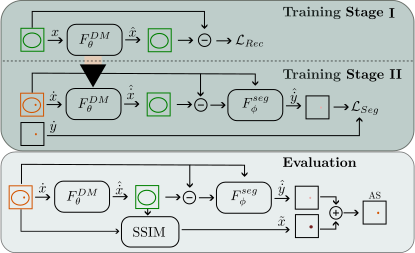

# Supervised-Anomaly-Detection-with-Diffusion-Models

Codebase for our MIDL2024 Paper [Combining Reconstruction-based Unsupervised Anomaly Detection with Supervised Segmentation for Brain MRIs](https://openreview.net/forum?id=iWfUcg4FrD&noteId=iWfUcg4FrD).

## Abstract

In contrast to supervised deep learning approaches, unsupervised anomaly detection (UAD) methods can be trained with healthy data only and do not require pixel-level annotations, enabling the identification of unseen pathologies. While this is promising for clinical screening tasks, reconstruction-based UAD methods fall short in segmentation accuracy compared to supervised models. Therefore, self-supervised UAD approaches have been proposed to improve segmentation accuracy. Typically, synthetic anomalies are used to train a segmentation network in a supervised fashion. However, this approach does not effectively generalize to real pathologies.
We propose a framework combining reconstruction-based and self-supervised UAD methods to improve both segmentation performance for known anomalies and generalization to unknown pathologies. The framework includes an unsupervised diffusion model trained on healthy data to produce pseudo-healthy reconstructions and a supervised Unet trained to delineate anomalies from deviations between input-reconstruction pairs. 
Besides the effective use of synthetic training data, this framework allows for weakly-supervised training with small annotated data sets, generalizing to unseen pathologies. Our results show that with our approach, utilizing annotated data sets during training can substantially improve the segmentation performance for in-domain data while maintaining the generalizability of reconstruction-based approaches to pathologies unseen during training.
## Data
We use the IXI data set, the BraTS21, MSLUB, ATLAS_v2 and WMH data set for our experiments. 
You can download/request the data sets here:

* [IXI](https://brain-development.org/ixi-dataset/)
* [BraTS21](http://braintumorsegmentation.org/)
* [ATLAS v2](https://fcon_1000.projects.nitrc.org/indi/retro/atlas)

After downloading and processing the directory structure of <DATA_DIR> should look like this: 

    <DATA_DIR>
    ├── Train
    │   └── ixi
    │       ├── mask
    │       └── t1
    ├── Test
    │   ├── Brats21
    │   │   ├── mask
    │   │   ├── t1
    │   │   └──seg
    │   └── ATLAS_v2
    │       ├── mask
    │       ├── t1
    │       └── seg
    │   
    ├── splits
    │   ├──  Brats21_test.csv        
    │   ├──  Brats21_val.csv   
    │   ├──  ATLAS_v2_val.csv 
    │   ├──  ATLAS_v2_test.csv
    │   ├──  IXI_train_fold0.csv
    │   ├──  IXI_train_fold1.csv 
    │   └── ...                
    └── ...

You should then specify the location of <DATA_DIR> in the pc_environment.env file. Additionally, specify the <LOG_DIR>, where runs will be saved. 

## Environment Set-up
To download the code type 

    git clone git@github.com:FinnBehrendt/Supervised-Anomaly-Detection-with-Diffusion-Models.git

In your linux terminal and switch directories via

    cd Supervised-Anomaly-Detection-with-Diffusion-Models

To setup the environment with all required packages and libraries, you need to install anaconda first. 

Then, run 

    conda env create -f environment.yml -n sadm-uad

and subsequently run 

    conda activate sadm-uad
    pip install -r requirements.txt

to install all required packages.

## Run Experiments

To run the training of the cDDPM, run 

    python run.py experiment=cDDPM/DDPM_cond_spark_2D model.cfg.pretrained_encoder=False

For slightly better performance, you can pretrain the encoder via masked pretraining (Spark) 

    python run.py experiment=cDDPM/Spark_2D_pretrain

Having pretrained the encoder, you can now run 

    python run.py experiment=cDDPM/DDPM_cond_spark_2D encoder_path=<path_to_pretrained_encoder>

to train the cDDPM.
The <path_to_pretrained_encoder> will be placed in the <LOG_DIR>. Alternatively, you will find the best checkpoint path printed in the terminal. 
For more details of the cDDPM and training, see the original cDDPM [repo](https://github.com/FinnBehrendt/Conditioned-Diffusion-Models-UAD) and [paper](https://arxiv.org/abs/2312.04215).

Having trained the cDDPM, you can run the SADM training. To train with synthetic anomalies (DRAEM) you can run 
   
    python run.py experiment=SADM/SADM_DRAEM model.cfg.ddpm_ckpt=<path_to_trained_cDDPM.ckpt>  

To train with real pathologies, you can run 

    python run.py experiment=SADM/SADM_BRATS model.cfg.ddpm_ckpt=<path_to_trained_cDDPM.ckpt>  

or 

    python run.py experiment=SADM/SADM_ATLAS model.cfg.ddpm_ckpt=<path_to_trained_cDDPM.ckpt>  

## Citation
    @inproceedings{behrendt2024combining,
      title={Combining Reconstruction-based Unsupervised Anomaly Detection with Supervised Segmentation for Brain MRIs},
      author={Behrendt, Finn and Bhattacharya, Debayan and Maack, Lennart and Kr{\"u}ger, Julia and Opfer, Roland and Schlaefer, Alexander},
      booktitle={Medical Imaging with Deep Learning},
      year={2024},
      url={https://openreview.net/forum?id=iWfUcg4FrD},
    }

